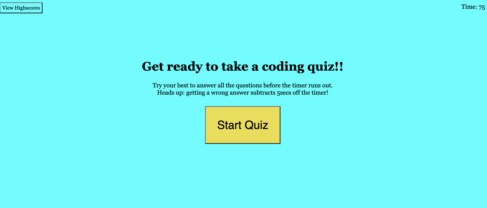
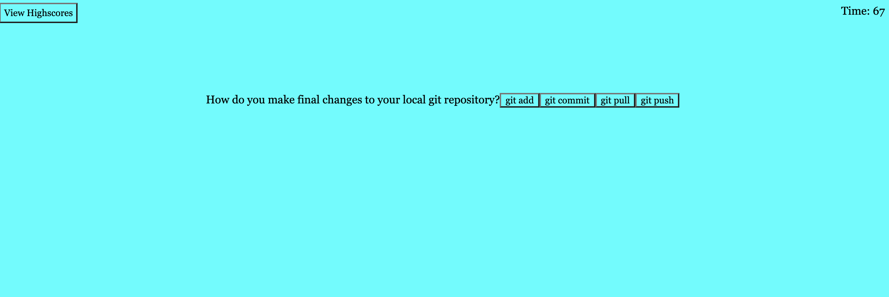
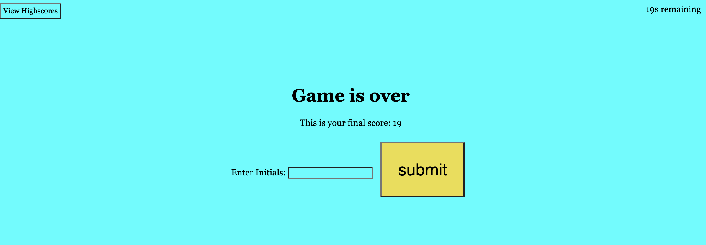

# code-quiz-
Come play my quiz game that has questions involving writing code for beginers. 
Users have four options per question, when the game begins a timer starts a countdown from 75. 
If you get the question wrong the timer will be subtracted by 5 seconds. 
If the question is answered correctly the time wont change. The end of the game will record the score of the current time.
You can save your highscore to local storage, and check the high scores list, where you are offered the options to clear the highscores or play again.

Screen Shots

User Story
AS A coding boot camp student
I WANT to take a timed quiz on JavaScript fundamentals that stores high scores
SO THAT I can gauge my progress compared to my peers

Acceptance Criteria
GIVEN I am taking a code quiz
WHEN I click the start button
THEN a timer starts and I am presented with a question
WHEN I answer a question
THEN I am presented with another question
WHEN I answer a question incorrectly
THEN time is subtracted from the clock
WHEN all questions are answered or the timer reaches 0
THEN the game is over
WHEN the game is over
THEN I can save my initials and my score

LIVE LINK
https://l-stew206.github.io/code-quiz-/

REPO LINK
https://github.com/L-Stew206/code-quiz-